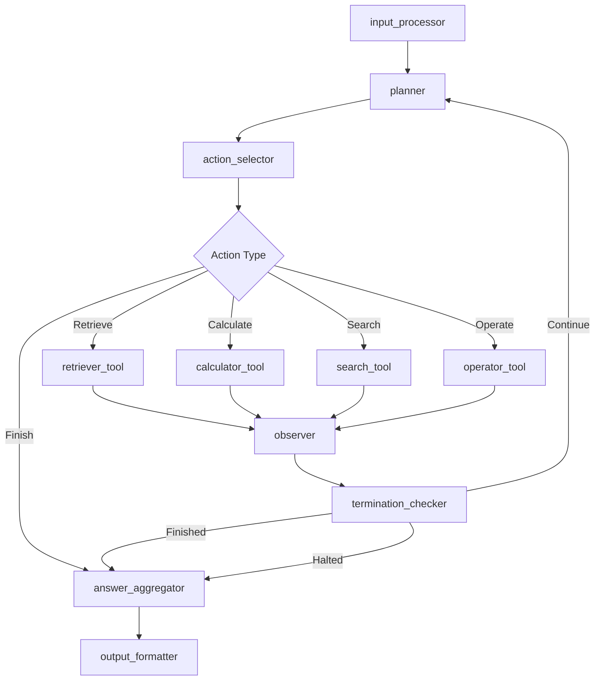

# MACT LangGraph 구현 계획

## 1. 개요

본 문서는 MACT (Multi-Agent Collaboration with Tool Use) 프레임워크를 LangGraph를 사용하여 재구현하는 계획을 제시합니다. 특히 MMQA (Multi-Modal Question Answering) 데이터셋에 대한 테이블 질의응답 성능 향상을 목표로 합니다.

### 목표
- MACT의 ReAct 패러다임을 LangGraph의 상태 그래프로 변환
- 멀티 에이전트 협업을 그래프 노드 간 데이터 흐름으로 구현
- MMQA 데이터셋에 특화된 효율적인 처리 파이프라인 구축
- 기존 MACT 대비 향상된 모듈성과 확장성 달성

## 2. MMQA 데이터셋 분석

### 2.1 데이터 구조
```json
{
  "id_": 0,
  "Question": "Which department currently headed by a temporary acting manager has the largest number of employees, and how many employees does it have?",
  "SQL": "SELECT d.Name, SUM(d.Num_Employees) FROM department d JOIN management m ON d.Department_ID = m.department_ID WHERE m.temporary_acting = 'Yes' GROUP BY d.Name ORDER BY SUM(d.Num_Employees) DESC LIMIT 1;",
  "table_names": ["department", "management"],
  "tables": [
    {
      "table_columns": ["Department_ID", "Name", "Creation", "Ranking", "Budget_in_Billions", "Num_Employees"],
      "table_content": [[1, "State", "1789", 1, 9.96, 30266.0], ...]
    },
    {
      "table_columns": ["department_ID", "head_ID", "temporary_acting"],
      "table_content": [[2, 5, "Yes"], [15, 4, "Yes"], ...]
    }
  ],
  "foreign_keys": ["head id", "department id"],
  "primary_keys": ["department id", "head id", "department id"],
  "answer": "Treasury, 115897"
}
```

### 2.2 MMQA 특징
- **멀티 테이블**: 각 질문이 2-3개의 관련 테이블을 포함
- **관계형 데이터**: Foreign Key와 Primary Key 관계 정보 제공
- **복잡한 조인**: 테이블 간 JOIN 연산이 필요한 질문들
- **SQL 쿼리**: 정답 도출을 위한 SQL이 제공됨 (참고용)
- **다양한 연산**: 집계, 필터링, 정렬, 그룹핑 등 복합 연산

## 3. MACT 핵심 컴포넌트의 LangGraph 노드 매핑

### 3.1 상태 정의 (State Schema)
```python
from typing import TypedDict, List, Dict, Any, Optional
from langgraph.graph import StateGraph

class MACTState(TypedDict):
    # Input data
    question: str
    tables: List[Dict[str, Any]]
    table_names: List[str]
    foreign_keys: List[str]
    primary_keys: List[str]
    context: str

    # Reasoning state
    current_step: int
    max_steps: int
    scratchpad: str
    thoughts: List[str]
    actions: List[str]
    observations: List[str]

    # Tool execution results
    table_operations: List[str]
    calculations: List[str]
    search_results: List[str]

    # Sampling and candidates
    candidate_actions: List[Dict[str, Any]]
    action_scores: List[float]

    # Final results
    answer: Optional[str]
    confidence: float
    is_finished: bool
    is_halted: bool

    # Models and configuration
    plan_model: str
    code_model: str
    reward_type: str
    plan_sample: int
    code_sample: int
```

### 3.2 노드 매핑

#### 3.2.1 입력 처리 노드
**Node: `input_processor`**
- **MACT 대응**: 데이터 로딩 및 전처리
- **기능**:
  - MMQA 데이터 파싱
  - 멀티 테이블 통합
  - 컨텍스트 정보 생성
  - 초기 상태 설정

#### 3.2.2 계획 생성 노드
**Node: `planner`**
- **MACT 대응**: `ReactAgent.prompt_agent()`
- **기능**:
  - 현재 상태 기반 프롬프트 생성
  - LLM을 통한 후보 행동 생성 (plan_sample 개수)
  - Thought-Action 쌍 추출
  - 상태 업데이트

#### 3.2.3 행동 선택 노드
**Node: `action_selector`**
- **MACT 대응**: `ReactAgent.as_reward_fn()`
- **기능**:
  - 다양한 보상 함수 적용 (consistency, llm, logp, rollout, combined)
  - 후보 행동들 중 최적 선택
  - 행동 유형 파싱 (Retrieve, Calculate, Search, Operate, Finish)

#### 3.2.4 도구 실행 노드들
**Node: `retriever_tool`**
- **MACT 대응**: `ReactAgent.retriever_tool()`
- **기능**: 테이블 검색 및 필터링

**Node: `calculator_tool`**
- **MACT 대응**: `ReactAgent.calculator_tool()`
- **기능**: 수식 계산 및 수치 연산

**Node: `search_tool`**
- **MACT 대응**: Wikipedia 검색
- **기능**: 외부 지식 검색

**Node: `operator_tool`**
- **MACT 대응**: `ReactAgent.numerical_tool()`
- **기능**: 복잡한 테이블 연산 및 JOIN

#### 3.2.5 관찰 처리 노드
**Node: `observer`**
- **MACT 대응**: 관찰 결과 처리
- **기능**:
  - 도구 실행 결과 포맷팅
  - 스크래치패드 업데이트
  - 다음 스텝 준비

#### 3.2.6 종료 조건 확인 노드
**Node: `termination_checker`**
- **MACT 대응**: `ReactAgent.is_finished()`, `ReactAgent.is_halted()`
- **기능**:
  - 완료 조건 확인 (Finish 액션 또는 최대 스텝)
  - 중단 조건 확인
  - 최종 답안 추출

#### 3.2.7 답안 집계 노드
**Node: `answer_aggregator`**
- **MACT 대응**: `ReactAgent.use_pre_answer` 로직
- **기능**:
  - 여러 시도에서 나온 답안들 집계
  - 일관성 기반 최종 답안 결정
  - 신뢰도 계산

## 4. 데이터 흐름 그래프 설계

### 4.1 그래프 구조


### 4.2 조건부 라우팅
```python
def route_action(state: MACTState) -> str:
    """행동 유형에 따른 노드 라우팅"""
    action_type = state["current_action_type"]

    if action_type == "Retrieve":
        return "retriever_tool"
    elif action_type == "Calculate":
        return "calculator_tool"
    elif action_type == "Search":
        return "search_tool"
    elif action_type == "Operate":
        return "operator_tool"
    elif action_type == "Finish":
        return "answer_aggregator"
    else:
        return "observer"  # 기본값

def check_termination(state: MACTState) -> str:
    """종료 조건 확인"""
    if state["is_finished"]:
        return "answer_aggregator"
    elif state["is_halted"]:
        return "answer_aggregator"
    elif state["current_step"] >= state["max_steps"]:
        return "answer_aggregator"
    else:
        return "planner"
```

### 4.3 상태 흐름
1. **초기화**: MMQA 데이터 로드 및 상태 초기화
2. **반복적 추론**: Thought → Action → Observation 사이클
3. **도구 실행**: 선택된 행동에 따른 도구 호출
4. **상태 업데이트**: 관찰 결과를 바탕으로 상태 갱신
5. **종료 판단**: 완료/중단 조건 확인
6. **답안 집계**: 최종 답안 도출 및 포맷팅

## 5. 필요한 LangGraph 의존성

### 5.1 핵심 패키지
```python
# LangGraph 핵심 패키지
langgraph>=0.0.40
langchain>=0.1.0
langchain-openai>=0.0.8
langchain-community>=0.0.20

# 상태 관리 및 직렬화
pydantic>=2.0.0
typing-extensions>=4.5.0

# 데이터 처리
pandas>=2.2.2
numpy>=1.26.4

# LLM 클라이언트
openai>=1.55.3

# 환경 관리
python-dotenv>=1.0.0

# 비동기 처리
asyncio
aiohttp>=3.8.0

# 테스트
pytest>=7.0.0
pytest-asyncio>=0.21.0
```

### 5.2 선택적 패키지
```python
# 시각화 (그래프 디버깅용)
graphviz>=0.20.0
matplotlib>=3.7.0

# 성능 모니터링
langsmith>=0.0.40
wandb>=0.15.0

# 병렬 처리
concurrent.futures
multiprocessing
```

## 6. 구현 우선순위 및 마일스톤

### 6.1 Phase 1: 기본 그래프 구조 (Week 1-2)
**목표**: 기본적인 LangGraph 구조 구축

**구현 항목**:
- [ ] 상태 스키마 정의 (`MACTState`)
- [ ] 기본 노드 스켈레톤 구현
  - [ ] `input_processor`
  - [ ] `planner`
  - [ ] `action_selector`
  - [ ] `observer`
  - [ ] `termination_checker`
- [ ] 그래프 구조 정의 및 연결
- [ ] MMQA 데이터 로더 구현
- [ ] 기본 테스트 케이스 작성

**마일스톤**:
- 단순한 "Hello World" 수준의 그래프 실행 성공
- MMQA 데이터 로딩 및 파싱 완료

### 6.2 Phase 2: 도구 통합 (Week 3-4)
**목표**: MACT의 핵심 도구들을 LangGraph 노드로 통합

**구현 항목**:
- [ ] 도구 노드 구현
  - [ ] `retriever_tool` - 테이블 검색
  - [ ] `calculator_tool` - 수식 계산
  - [ ] `operator_tool` - 테이블 연산
  - [ ] `search_tool` - Wikipedia 검색
- [ ] 행동 파싱 로직 (`parse_action`)
- [ ] 조건부 라우팅 구현
- [ ] 오류 처리 및 복구 메커니즘

**마일스톤**:
- 모든 도구가 개별적으로 동작
- 간단한 단일 스텝 질문 해결 가능

### 6.3 Phase 3: 추론 엔진 구현 (Week 5-6)
**목표**: MACT의 ReAct 추론 엔진 구현

**구현 항목**:
- [ ] LLM 통합 (`UnifiedLLM` 연동)
- [ ] 프롬프트 템플릿 포팅
- [ ] 샘플링 로직 구현 (plan_sample, code_sample)
- [ ] 보상 함수 구현
  - [ ] Consistency 기반 선택
  - [ ] LLM 기반 평가
  - [ ] Log probability 기반
  - [ ] Rollout 기반
  - [ ] Combined 방법
- [ ] 스크래치패드 관리

**마일스톤**:
- 다중 스텝 추론 가능
- 다양한 보상 함수 적용 가능

### 6.4 Phase 4: MMQA 특화 최적화 (Week 7-8)
**목표**: MMQA 데이터셋에 특화된 기능 구현

**구현 항목**:
- [ ] 멀티 테이블 처리 로직
- [ ] Foreign Key/Primary Key 활용
- [ ] JOIN 연산 최적화
- [ ] 테이블 크기 최적화 (long_table_op)
- [ ] SQL 힌트 활용 (참고용 SQL 쿼리)
- [ ] 성능 벤치마킹

**마일스톤**:
- MMQA 테스트셋에서 기본 성능 달성
- 기존 MACT와 동등한 정확도

### 6.5 Phase 5: 성능 최적화 및 배포 (Week 9-10)
**목표**: 성능 최적화 및 프로덕션 준비

**구현 항목**:
- [ ] 비동기 처리 최적화
- [ ] 메모리 사용량 최적화
- [ ] 배치 처리 구현
- [ ] 모니터링 및 로깅 시스템
- [ ] 설정 관리 및 환경 변수
- [ ] 문서화 및 예제 작성
- [ ] CI/CD 파이프라인 구축

**마일스톤**:
- 프로덕션 환경 배포 가능
- 성능 지표 모니터링 체계 구축

## 7. 성능 최적화

### 7.1 Phase 1: 초기 속도 및 안정성 확보

*   **목표**: 40분 이상 소요되던 전체 데이터셋 실행 시간을 단축하고, 불안정한 추론 과정을 안정화하여 재구현된 코드의 실행 가능성을 검증.
*   **결과**: 전체 실행 시간을 약 19% 단축(43분 -> 35분)하고, 모든 데이터셋 항목을 오류 없이 완주하는 안정성을 확보.

#### 완료된 작업 상세:

1.  **문제 원인 분석**:
    *   **느린 속도**: LLM이 잘못된 코드를 생성하고, 시스템이 이를 여러 번 재호출하는 '순차 재시도' 로직이 원인임을 파악. 이는 원본 MACT의 '일괄 생성' 방식과 달라 비효율적임.
    *   **추론 실패**: Qwen 모델이 ReAct 규칙을 무시하고 도구 사용 없이 바로 `Finish` 액션을 호출하는 경향을 발견.

2.  **프롬프트 강화**:
    *   `prompt_utils.py`의 Qwen 모델 전용 시스템 프롬프트(`REACT_SYSTEM_PROMPT_QWEN`)를 수정.
    *   "도구를 먼저 사용할 것", "Finish로 시작하지 말 것" 등 명시적인 규칙을 추가하여 ReAct 프레임워크 준수를 강제.
    *   **결과**: 이 수정으로 모델이 추론 단계를 시작하고 도구를 사용하게 되었으나, 코드 품질이 낮아 실행 오류가 빈번했음.

3.  **코드 자동 클리닝 기능 구현**:
    *   `table_utils.py`에 `clean_qwen_code` 유틸리티 함수를 추가.
    *   LLM이 생성한 코드에서 실행을 방해하는 자연어 설명, 잘못된 주석 등을 프로그래밍 방식으로 제거.
    *   `extract_code_from_response` 함수를 수정하여 Qwen 모델 사용 시 이 클리닝 기능이 자동으로 동작하도록 연결.

4.  **API 호출 로직 최적화 (원본 MACT 로직 복원)**:
    *   `tool_nodes.py`의 `retriever_tool_node`와 `operator_tool_node`를 대대적으로 리팩토링.
    *   **(기존)**: 코드 생성 실패 시 매번 API를 새로 호출하는 비효율적인 방식.
    *   **(변경)**: 원본 MACT처럼 `llm.abatch()`를 사용해 한 번의 API 요청으로 `code_sample` 개수만큼의 코드 후보를 병렬로 받아오도록 수정. API 호출 횟수를 1/N으로 줄여 속도 개선 및 비용 절감.
    *   **결과**: 이 로직 수정으로 LangGraph 구현이 원본 MACT와 동일한 효율적인 동작 방식을 갖게 되었으며, 최종적으로 안정적인 실행과 속도 개선을 달성.

## 8. 상세 구현 계획

### 8.1 상태 스키마 구현
```python
from typing import TypedDict, List, Dict, Any, Optional
from dataclasses import dataclass
from enum import Enum

class ActionType(Enum):
    RETRIEVE = "Retrieve"
    CALCULATE = "Calculate"
    SEARCH = "Search"
    OPERATE = "Operate"
    FINISH = "Finish"

class RewardType(Enum):
    CONSISTENCY = "consistency"
    LLM = "llm"
    LOGP = "logp"
    ROLLOUT = "rollout"
    COMBINED = "combined"

@dataclass
class TableInfo:
    name: str
    columns: List[str]
    content: List[List[Any]]
    df_code: str

@dataclass
class ActionCandidate:
    thought: str
    action: str
    action_type: ActionType
    argument: str
    score: float

class MACTState(TypedDict):
    # Input data
    question: str
    tables: List[TableInfo]
    table_names: List[str]
    foreign_keys: List[str]
    primary_keys: List[str]
    context: str

    # Reasoning state
    current_step: int
    max_steps: int
    max_actual_steps: int
    scratchpad: str

    # Current iteration
    current_thought: str
    current_action: str
    current_observation: str

    # Sampling results
    candidate_actions: List[ActionCandidate]
    selected_action: Optional[ActionCandidate]

    # Tool results
    tool_results: List[str]
    calculation_results: List[float]
    search_results: List[str]

    # Answer tracking
    preliminary_answers: List[str]
    answer_frequencies: Dict[str, int]
    final_answer: Optional[str]
    confidence_score: float

    # Status flags
    is_finished: bool
    is_halted: bool
    has_error: bool
    error_message: str

    # Configuration
    plan_model: str
    code_model: str
    reward_type: RewardType
    plan_sample: int
    code_sample: int
    use_pre_answer: bool
    answer_threshold: float
```

### 8.2 노드 구현 예시
```python
from langgraph.graph import StateGraph, END
from langchain_openai import ChatOpenAI

def create_mact_graph() -> StateGraph:
    """MACT 그래프 생성"""

    # 그래프 초기화
    workflow = StateGraph(MACTState)

    # 노드 추가
    workflow.add_node("input_processor", input_processor_node)
    workflow.add_node("planner", planner_node)
    workflow.add_node("action_selector", action_selector_node)
    workflow.add_node("retriever_tool", retriever_tool_node)
    workflow.add_node("calculator_tool", calculator_tool_node)
    workflow.add_node("search_tool", search_tool_node)
    workflow.add_node("operator_tool", operator_tool_node)
    workflow.add_node("observer", observer_node)
    workflow.add_node("termination_checker", termination_checker_node)
    workflow.add_node("answer_aggregator", answer_aggregator_node)

    # 엣지 정의
    workflow.set_entry_point("input_processor")
    workflow.add_edge("input_processor", "planner")
    workflow.add_edge("planner", "action_selector")

    # 조건부 라우팅
    workflow.add_conditional_edges(
        "action_selector",
        route_action,
        {
            "retriever_tool": "retriever_tool",
            "calculator_tool": "calculator_tool",
            "search_tool": "search_tool",
            "operator_tool": "operator_tool",
            "answer_aggregator": "answer_aggregator"
        }
    )

    # 도구에서 관찰자로
    workflow.add_edge("retriever_tool", "observer")
    workflow.add_edge("calculator_tool", "observer")
    workflow.add_edge("search_tool", "observer")
    workflow.add_edge("operator_tool", "observer")

    # 관찰자에서 종료 확인으로
    workflow.add_edge("observer", "termination_checker")

    # 종료 조건부 라우팅
    workflow.add_conditional_edges(
        "termination_checker",
        check_termination,
        {
            "continue": "planner",
            "finish": "answer_aggregator"
        }
    )

    # 최종 노드
    workflow.add_edge("answer_aggregator", END)

    return workflow.compile()

async def input_processor_node(state: MACTState) -> MACTState:
    """입력 데이터 처리 노드"""
    # MMQA 데이터 파싱 및 전처리
    processed_tables = []
    for table_data in state["tables"]:
        table_info = TableInfo(
            name=table_data.get("name", "Unknown"),
            columns=table_data["table_columns"],
            content=table_data["table_content"],
            df_code=table2df([table_data["table_columns"]] + table_data["table_content"])
        )
        processed_tables.append(table_info)

    return {
        **state,
        "tables": processed_tables,
        "current_step": 1,
        "is_finished": False,
        "is_halted": False,
        "scratchpad": "",
        "candidate_actions": [],
        "preliminary_answers": []
    }

async def planner_node(state: MACTState) -> MACTState:
    """계획 생성 노드"""
    # 프롬프트 생성
    prompt = build_react_prompt(state)

    # LLM 호출하여 후보 행동들 생성
    llm = ChatOpenAI(model=state["plan_model"], temperature=0.6)
    candidates = []

    for _ in range(state["plan_sample"]):
        response = await llm.ainvoke(prompt)
        thought, action = parse_thought_action(response.content)
        action_type, argument = parse_action(action)

        candidate = ActionCandidate(
            thought=thought,
            action=action,
            action_type=ActionType(action_type) if action_type else ActionType.FINISH,
            argument=argument,
            score=0.0
        )
        candidates.append(candidate)

    return {
        **state,
        "candidate_actions": candidates
    }

def route_action(state: MACTState) -> str:
    """행동 타입에 따른 라우팅"""
    if not state["selected_action"]:
        return "answer_aggregator"

    action_type = state["selected_action"].action_type

    if action_type == ActionType.RETRIEVE:
        return "retriever_tool"
    elif action_type == ActionType.CALCULATE:
        return "calculator_tool"
    elif action_type == ActionType.SEARCH:
        return "search_tool"
    elif action_type == ActionType.OPERATE:
        return "operator_tool"
    elif action_type == ActionType.FINISH:
        return "answer_aggregator"
    else:
        return "answer_aggregator"
```

### 8.3 MMQA 특화 처리
```python
def process_mmqa_tables(tables_data: List[Dict]) -> List[TableInfo]:
    """MMQA 테이블 데이터 처리"""
    processed_tables = []

    for table_data in tables_data:
        # 테이블 정보 추출
        columns = table_data["table_columns"]
        content = table_data["table_content"]
        name = table_data.get("table_name", f"table_{len(processed_tables)}")

        # DataFrame 코드 생성
        table_rows = [columns] + content
        df_code = table2df(table_rows)

        table_info = TableInfo(
            name=name,
            columns=columns,
            content=content,
            df_code=df_code
        )
        processed_tables.append(table_info)

    return processed_tables

def create_mmqa_context(
    table_names: List[str],
    foreign_keys: List[str],
    primary_keys: List[str]
) -> str:
    """MMQA 컨텍스트 정보 생성"""
    context_parts = []

    if table_names:
        context_parts.append(f"Tables: {', '.join(table_names)}")

    if foreign_keys:
        context_parts.append(f"Foreign Keys: {', '.join(foreign_keys)}")

    if primary_keys:
        context_parts.append(f"Primary Keys: {', '.join(primary_keys)}")

    return " | ".join(context_parts)

def build_multi_table_prompt(state: MACTState) -> str:
    """멀티 테이블 환경을 위한 프롬프트 생성"""
    prompt_parts = [
        "You are an expert at answering questions about multiple related tables.",
        f"Question: {state['question']}",
        f"Context: {state['context']}",
        "",
        "Available Tables:"
    ]

    for i, table in enumerate(state["tables"]):
        prompt_parts.append(f"Table {i+1}: {table.name}")
        prompt_parts.append(f"Columns: {', '.join(table.columns)}")
        prompt_parts.append("")

    prompt_parts.extend([
        "You can use the following actions:",
        "- Retrieve[table_name, condition]: Get data from a specific table",
        "- Calculate[expression]: Perform calculations",
        "- Operate[sql_like_operation]: Perform JOIN or complex operations",
        "- Search[query]: Search external knowledge",
        "- Finish[answer]: Provide final answer",
        "",
        f"Current reasoning:
{state['scratchpad']}",
        "",
        "Think step by step and choose your next action."
    ])

    return "
".join(prompt_parts)
```

## 9. 성능 및 품질 지표

### 9.1 성능 지표
- **정확도**: MMQA 테스트셋에서 Exact Match 정확도
- **실행 시간**: 질문당 평균 처리 시간
- **토큰 사용량**: LLM API 호출 비용
- **메모리 사용량**: 피크 메모리 사용량
- **처리량**: 분당 처리 가능한 질문 수

### 9.2 품질 지표
- **코드 커버리지**: 90% 이상
- **타입 안정성**: mypy 검사 통과
- **문서화**: 모든 공개 함수 docstring 작성
- **테스트**: 단위/통합/E2E 테스트 완비

### 9.3 비교 기준
- **기존 MACT**: 동일 조건에서 성능 비교
- **단순 LLM**: Direct prompting 대비 성능 향상
- **다른 프레임워크**: LangChain Agent 등과 비교

## 10. 리스크 및 대응 방안

### 10.1 기술적 리스크
**리스크**: LangGraph 학습 곡선
- **대응**: 단계별 구현 및 공식 문서 활용

**리스크**: 성능 저하 가능성
- **대응**: 성능 벤치마킹 및 최적화 포인트 식별

**리스크**: MMQA 데이터 특성으로 인한 복잡성
- **대응**: 단계별 검증 및 테스트 케이스 확충

### 10.2 일정 리스크
**리스크**: 예상보다 긴 개발 시간
- **대응**: 최소 기능(MVP) 우선 구현 후 점진적 개선

**리스크**: 통합 문제로 인한 지연
- **대응**: 조기 통합 테스트 및 CI/CD 구축

## 11. 향후 확장 계획

### 11.1 추가 데이터셋 지원
- WTQ, TAT, CRT, SciTab 등 다른 테이블 QA 데이터셋
- 데이터셋별 특화 노드 및 처리 로직

### 11.2 고급 기능
- 적응형 샘플링 (동적 plan_sample 조절)
- 학습 기반 보상 함수
- 멀티모달 입력 지원 (이미지 테이블 등)

### 11.3 배포 최적화
- 서버리스 배포 (AWS Lambda, Google Cloud Functions)
- 컨테이너화 및 Kubernetes 배포
- 실시간 API 서비스

---

이 구현 계획은 MACT의 핵심 아이디어를 LangGraph의 현대적인 그래프 기반 아키텍처로 전환하여, 더 나은 모듈성, 확장성, 유지보수성을 제공하는 것을 목표로 합니다.
