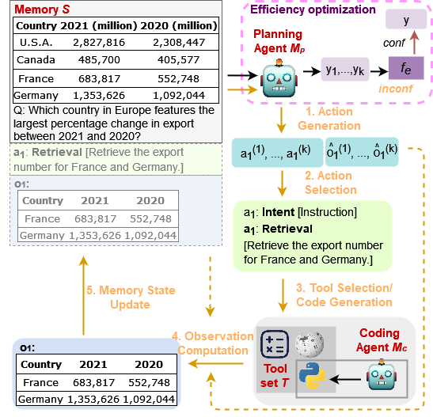

# [NAACL 2025] [Efficient Multi-Agent Collaboration with Tool Use for Online Planning in Complex Table Question Answering](https://arxiv.org/abs/2412.20145)

<p style="text-align: center">

### Environment

```
conda create --name mact python=3.10 -y
conda activate mact
pip install -r requirements.txt
```

### Data

We support the following datasets:

- [WTQ](https://github.com/ppasupat/WikiTableQuestions/tree/master/data), [TAT](https://github.com/NExTplusplus/TAT-QA/tree/master/dataset_raw), [CRT](https://github.com/zzh-SJTU/CRT-QA), [SciTab](https://github.com/XinyuanLu00/SciTab/tree/main/dataset), [DataBench](https://huggingface.co/datasets/cardiffnlp/databench/tree/main)
- Each instance in the dataset should contain at least following fields:

```
{"statement": a question or a statement in string format,
 "table_text": a table in list format containing lists of rows,
 "answer": a list containing answer(s).}
```

You can find examples in the folder `datasets_examples`.

### Code Structure

`code/tqa.py`: main script for running experiments.

`code/agent.py`: script containing classes and functions for controlling agent behaviours.

`code/llm.py`: script for LLMs calling.

`code/tot.py`: script containing functions and prompts for using LLM to select best actions.

`code/utils.py`: script containing helpful functions for running experiments.

`code/prompts_table.py`: prompts used in our experiments.

`code/fewshots_table.py`: few shot demostrations used in our experiments.

### Usages

#### run with closed-sourced gpt models

1. In the `agent.py`, add information for `load_gpt_azure ` and comment out line 73.
2. run the following command.
   ```
   python tqa.py --plan_model_name  gpt-35-turbo \
   --code_model_name  gpt-35-turbo  \
   --dataset_path  ../datasets_examples/tat.jsonl \
   --task  tat
   ```

#### run with open-source models

1. Set up the coding agent with SGLang. See [details](https://docs.sglang.ai/backend/send_request.html#Launch-A-Server).
   ```
   python -m sglang.launch_server --model-path  path_to_the_coding_model --port  port_number
   ```
2. run the command in the step 2 above and specify port number `--code_endpoint  port_number `

### Evaluations

- We use evaluation scripts from [WTQ dataset](https://github.com/ppasupat/WikiTableQuestions/blob/master/evaluator.py) to measure Exact Match Accuracy for WTQ, CRT and SciTab.
- We use the official evaluation scripts from [TAT](https://github.com/NExTplusplus/TAT-QA/blob/master/tatqa_eval.py) to evaluate models' performances on the TAT dataset.

### Cite

```
@misc{zhou2025efficientmultiagentcollaborationtool,
      title={Efficient Multi-Agent Collaboration with Tool Use for Online Planning in Complex Table Question Answering},
      author={Wei Zhou and Mohsen Mesgar and Annemarie Friedrich and Heike Adel},
      year={2025},
      eprint={2412.20145},
      archivePrefix={arXiv},
      primaryClass={cs.CL},
      url={https://arxiv.org/abs/2412.20145},
}
```
